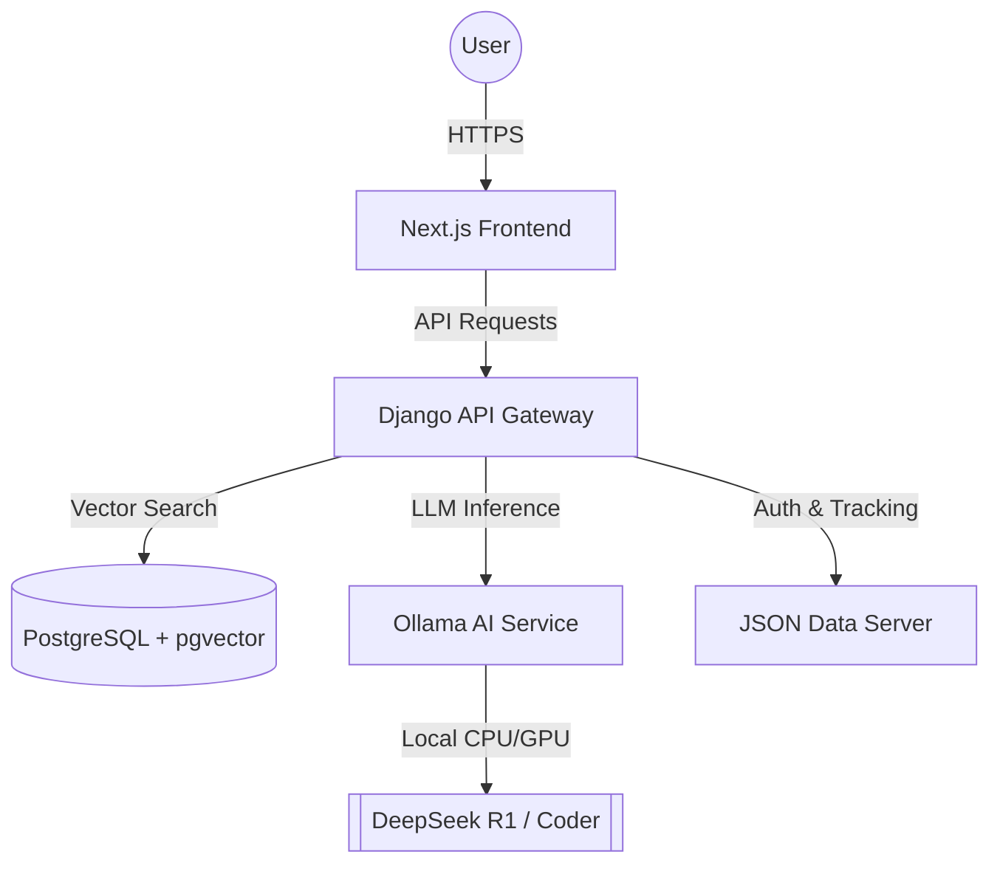

# 📚 Libro-Mind Project Documentation

Welcome to the comprehensive documentation for **Libro-Mind**, an AI-Powered Bibliographic Discovery engine.

## 🌟 Overview
Libro-Mind is built on a modular microservices architecture, leveraging Retrieval-Augmented Generation (RAG), Semantic Search, and Large Language Models (LLMs) to provide dynamic, personalized book recommendations. The system is designed to understand natural language queries (e.g., "I want a sci-fi book about time travel") rather than relying on exact keyword matches.

## 🏗️ Architecture & Components



The system is divided into five specialized microservices to ensure scalability, fault tolerance, and clear separation of concerns:

### 1. Next.js Frontend (`frontend`)
- **Technology Stack:** React, Next.js 16 (App Router), TailwindCSS, TypeScript.
- **Functionality:** Provides the interactive user interface. It utilizes Server-Side Rendering (SSR) for SEO and performance, and Client-Side React components for handling real-time, streaming Server-Sent Events (SSE) from the AI engine. This ensures the user sees the AI "typing out" its reasoning dynamically.

### 2. Django Backend (`backend`)
- **Technology Stack:** Python 3.11, Django, Django Rest Framework (DRF), LangChain.
- **Functionality:** Acts as the central orchestrator and API Gateway. 
  - Handles traditional eCommerce logic (Cart, Checkout, User Sessions).
  - Orchestrates the **RAG Pipeline**: When a search is made, it converts the query into a vector embedding using `SentenceTransformers` (`all-MiniLM-L6-v2`), searches the PostgreSQL database for similar book vectors, and constructs a prompt combining the user's query with the retrieved book metadata. This prompt is then sent to the Ollama service to generate human-readable recommendations.

### 3. PostgreSQL Database (`postgres`)
- **Technology Stack:** PostgreSQL 15, `pgvector` extension.
- **Functionality:** Acts as both a relational database for user/cart data and a highly efficient Vector Database. It stores over 9,800 book records, each containing a dense vector embedding of its plot and metadata, allowing for rapid K-Nearest Neighbor (KNN) semantic similarity searches.

### 4. Ollama AI Service (`ollama`)
- **Technology Stack:** Ollama, DeepSeek Models.
- **Functionality:** A stateless, containerized inference server dedicated to running Large Language Models locally. By default, it runs `deepseek-r1:1.5b` to provide fast, locally-hosted reasoning without requiring external API keys (like OpenAI) or compromising user privacy.

### 5. JSON-Server (`json-server`)
- **Technology Stack:** Node.js, json-server.
- **Functionality:** A lightweight mock backend used primarily for rapid prototyping, managing auxiliary user profile data, and tracking offline authentication states during development without altering the primary Django schemas.

---

## 🧠 The AI Pipeline (RAG) Explained
When a user searches for a book, the following pipeline executes:
1. **Embedding Generation**: The Django backend uses `SentenceTransformer` to convert the text query into a 384-dimensional vector array.
2. **Vector Retrieval**: This vector is sent to PostgreSQL. Using `pgvector`, the database calculates the cosine similarity between the query vector and the 9,800+ book vectors, returning the top 5 most contextually relevant books.
3. **Prompt Construction**: Django formats these 5 books into a strictly defined prompt.
4. **LLM Generation**: The prompt is sent to the Ollama container. The AI reads the book data and generates a personalized response explaining *why* these books match the user's specific request.
5. **Streaming**: The AI's response is streamed back through Django to the Next.js frontend token-by-token.

---

## 🚀 Deployment Guide

### Local Development (Minikube)
Optimized for developer productivity, local testing, and offline capability.

**Steps:**
1. Ensure Docker Desktop and Minikube are installed.
2. Execute the local deployment script:
   ```bash
   ./start_cluster_local.sh
   ```
3. **What happens under the hood?**
   - Starts a Minikube cluster with optimized resources (7GB RAM, 6 CPUs).
   - Builds the backend and frontend Docker images directly inside the Minikube registry to bypass external pushes.
   - Applies Kubernetes Deployments, Services, and StatefulSets (`k8s-manifests/*.yaml`).
   - Restores the 50MB PostgreSQL backup containing the book catalog and pre-computed embeddings.
   - Sets up fixed `kubectl port-forward` tunnels for reliable local host access.

**Access Points:**
- **Frontend App**: `http://127.0.0.1:3000`
- **Backend/Admin API**: `http://127.0.0.1:8000`

### Cloud Production (Google Kubernetes Engine)
Designed for high availability, massive scale, and secure production workloads using Infrastructure as Code (IaC).

**Steps:**
1. Authenticate with Google Cloud using `gcloud auth login`.
2. Run the deployment script:
   ```bash
   ./deploy_cloud.sh
   ```
3. **What happens under the hood?**
   - Provisions a standard 3-node GKE cluster across multiple availability zones.
   - Sets up Workload Identity Federation, allowing GitHub Actions to deploy without storing static service account keys.
   - Pushes Docker images to Google Artifact Registry (GAR).
   - Exposes the application to the public internet using a secure NGINX Ingress Controller LoadBalancer.

---

## 🔧 Troubleshooting & Known Issues

During development and testing, you may encounter the following common issues. Here is how they are resolved:

### 1. `psycopg2.OperationalError: FATAL: could not write init file`
**Cause:** Your Minikube virtual machine or Docker Desktop has run completely out of disk space (`No space left on device`). This is extremely common due to the large file size of the Ollama AI models and the PostgreSQL vector database.
**Fix:** Prune unused Docker images to free up space, or permanently increase your Docker Desktop virtual disk limit in the Docker Desktop settings.
```bash
docker exec minikube docker system prune -a -f
kubectl rollout restart deployment backend -n libro-mind
```

### 2. Frontend Error: `timed out` during AI Search
**Cause:** Running LLM inference locally on a laptop CPU is mathematically intensive and slow (approx. 0.18 tokens per second). The Next.js frontend or the Django server will inevitably time out if the AI takes longer than 30-60 seconds to generate a response.
**Fix:** The Django backend is equipped with a persistent `SearchQueryCache`. If a search times out on the frontend, simply wait 1-2 minutes for the backend to finish generating the response in the background. The next time you execute the exact same search, it will hit the database cache and return the results instantly.

### 3. Port Mismatch / Broken Backend Links
**Cause:** In older versions, using `minikube service` assigned a random, rotating port to the backend on every restart, breaking hardcoded frontend links.
**Fix:** The `start_cluster_local.sh` script has been updated to strictly use `kubectl port-forward`, which binds the frontend to `3000` and the backend to `8000` deterministically. Always use the updated script to prevent link breakages.

### 4. Missing CSS / Broken Page Styling on Django Views
**Cause:** The legacy Django eCommerce templates (e.g., `product.html`, `home.html`) relied on a missing local `styles.css` file, causing the layout to lose all formatting.
**Fix:** The global `base.html` template has been successfully patched to pull the required Bootstrap 5 CSS directly from a remote CDN (`https://cdn.jsdelivr.net/npm/bootstrap@5.2.3/dist/css/bootstrap.min.css`), ensuring styles render perfectly regardless of local static file configuration.
