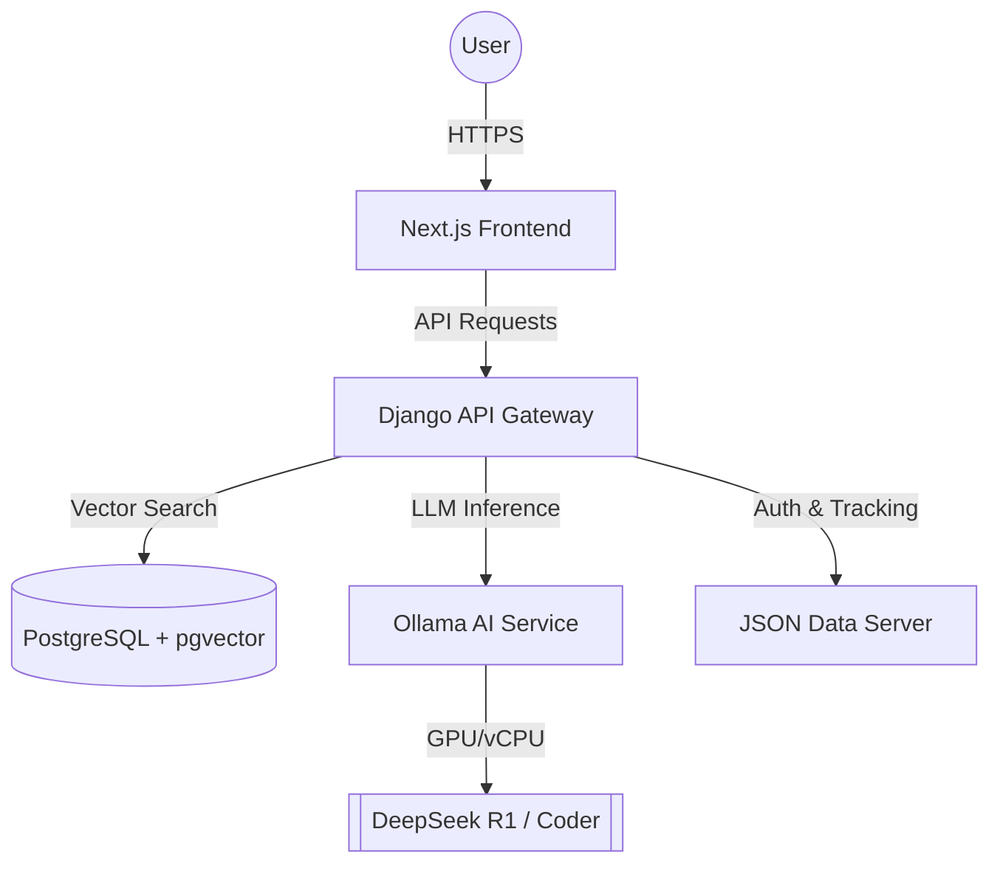

# 📚 Libro-Mind: AI-Powered Bibliographic Discovery

Libro-Mind is a state-of-the-art bibliographic recommendation engine built on a modular microservices architecture. It leverages **Retrieval-Augmented Generation (RAG)**, **Semantic Search**, and **Large Language Models (LLMs)** to provide personalized book discoveries based on natural language queries.

---

## 🏗️ Microservices Architecture

The application is decomposed into five specialized services, ensuring scalability and isolation:



### 🛰️ Core Components:
*   **Next.js Frontend**: A high-performance React application featuring real-time streaming AI responses and a modern UI.
*   **Django Backend**: The orchestrator. It manages the RAG pipeline, re-ranking logic, and business rules.
*   **Ollama Service**: High-speed local LLM inference hosting `deepseek-r1:1.5b` and `deepseek-coder:1.3b`.
*   **PostgreSQL + pgvector**: A vector database housing over 9,800 book embeddings for instant semantic retrieval.
*   **JSON-Server**: A lightweight service managing user profiles and recommendation history.

---

## 🚀 Deployment Systems

Libro-Mind is designed to run everywhere, from a local laptop to a globally distributed cloud.

### 1. 🏡 Local Deployment (Minikube)
Optimized for developer productivity and local testing.
*   **System**: Kubernetes on Docker Desktop.
*   **Automation**: `start_cluster_local.sh`.
*   **Features**: Automated image building, LoadBalancer tunneling, and health monitoring.

### 2. ☁️ Google Cloud (GKE)
Production-grade deployment on Google Kubernetes Engine.
*   **Infrastructure**: Zonal GKE Cluster (Standard, 3 nodes).
*   **Automation**: `deploy_cloud.sh`.
*   **CI/CD**: Automated via **GitHub Actions** (`google.yml`, `terraform.yml`).
*   **Security**: Workload Identity Federation for secret-less authentication.

---

## 🛠️ Getting Started: Local (Minikube)

### Prerequisites:
*   Docker Desktop installed.
*   Minikube installed.
*   `kubectl` installed.

### Setup:
1.  **Clone the repository**:
    ```bash
    git clone https://github.com/sergioitremotejobs2025-sketch/Azacan.git
    cd Azacan
    ```
2.  **Run the Local Cluster Script**:
    ```bash
    ./start_cluster_local.sh
    ```
    *This script builds all images, starts Minikube, applies manifests, and seeds the database.*
3.  **Access the app**:
    Once the tunnel is established, visit: `http://localhost:3000`

---

## 🌍 Getting Started: Google Cloud (GKE)

### Prerequisites:
*   GCP Account with billing enabled.
*   `gcloud` CLI installed.

### Setup:
1.  **Initialize the Deployment**:
    ```bash
    chmod +x deploy_cloud.sh
    ./deploy_cloud.sh
    ```
    *This script automates:*
    - Enabling GKE, Artifact Registry, and Compute APIs.
    - Provisioning the GKE cluster.
    - Pulling AI models into the cloud environment.
    - Importing the 9,800+ book catalog.
2.  **Access the Public App**:
    The script will output the **External IP** of your LoadBalancer.
    - **Frontend**: `http://[EXTERNAL_IP]:3000`
    - **Admin Console**: `http://[EXTERNAL_IP]:8000/admin/`

---

## 🛠️ Tech Stack
*   **Core**: Python 3.11, Node.js 20, TypeScript.
*   **Frameworks**: Django Rest Framework (DRF), Next.js 16 (Turbopack).
*   **AI/ML**: Ollama, LangChain, SentenceTransformers.
*   **Ops**: Kubernetes, Helm, Terraform, GitHub Actions.
*   **Data**: PostgreSQL (pgvector), Redis (Caching), JSON-Server.

---

## 🤝 Credentials (Initial Setup)
*   **User**: `admin@example.com`
*   **Password**: `admin1234`

---
*Created with ❤️ by the Libro-Mind Team.*
